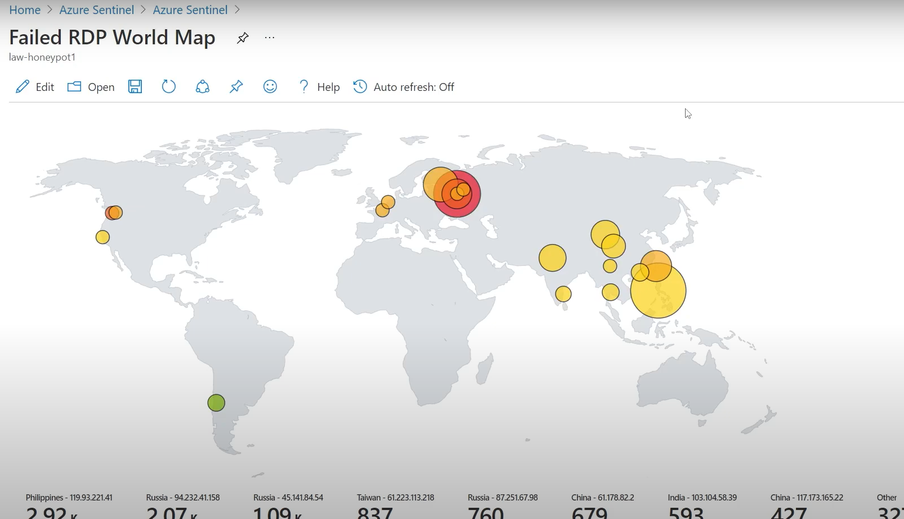

# Azure Sentinel RDP Honeypot Project with Real-Time Attack Mapping


## 📌 Overview
This project demonstrates how to set up a Windows VM in Microsoft Azure as an **RDP honeypot** to attract brute-force attacks, and how to monitor those attacks in **real-time using Microsoft Sentinel** on a world map.

---

## 🧠 Objectives
- Simulate a real-world attack surface using a deliberately exposed RDP port.
- Capture failed login attempts.
- Geolocate attacking IP addresses.
- Visualize attacks on a dynamic map using Azure Sentinel.

---
## 🛡️ Security Information and Event Management (SIEM)

**Security Information and Event Management (SIEM)** is a cybersecurity solution that helps organizations detect, investigate, and respond to potential security threats before they disrupt business operations.

SIEM platforms combine:
- **Security Information Management (SIM)**: Log collection, storage, and analysis.
- **Security Event Management (SEM)**: Real-time event correlation and alerting.

📌 Originally coined by **Gartner in 2005**, SIEMs have evolved to include:
- User and Entity Behavior Analytics (UEBA)
- Advanced Security Analytics
- AI and Machine Learning (ML) for anomaly detection
- Automated threat detection and response

Modern SIEMs, such as **Microsoft Sentinel**, are central to Security Operation Centers (SOCs) for:
- Threat detection
- Incident response
- Compliance management

---

## 📊 Log Aggregation Process

**Log aggregation** is the foundation of any SIEM system. It involves collecting and processing logs from various systems to prepare them for analysis.

### Key Steps in Log Aggregation:

1. **Installation of Agents**  
   Deploy agents on endpoints to begin collecting log data.

2. **Parsing**  
   Extract and structure relevant data from raw logs.

3. **Normalization**  
   Convert diverse log formats into a standard, unified format.

4. **Filtration**  
   Remove redundant or irrelevant log data to reduce noise.

5. **Categorization**  
   Group logs by their source or event type for better organization.

6. **Data Enrichment**  
   Add additional context like geolocation, hostnames, or threat intel.

7. **Indexing**  
   Organize logs for fast and efficient searching and retrieval.

8. **Storage**  
   Securely store logs for analysis, historical tracking, and compliance.

9. **Writing Rules**  
   Define logic for log handling, routing, alerting, and automated response.

> 💡 Effective log aggregation is essential for real-time threat detection and forensic analysis within any SIEM framework.

---


## 🛠️ Setup Steps

### 1. Create a Windows VM in Azure
- Deploy a Windows 10 VM.
- Open **RDP port (3389)** to the public internet.
- Disable firewall and other security features to allow brute-force attempts.

### 2. Set Up Log Analytics Workspace
- Create a **Log Analytics workspace** in Azure.
- Connect the VM to the workspace via Azure Monitor.
- Ingest **SecurityEvent** logs (enable all events).

### 3. Install Microsoft Sentinel
- Add Microsoft Sentinel to the workspace.
- Set up a **custom connector** to ingest logs from your honeypot VM.

### 4. Log Failed RDP Attempts
- Use **Event Viewer** to monitor Event ID `4625` (failed logon).
- Run a PowerShell script to:
  - Extract source IPs from logs.
  - Call a geolocation API to fetch `latitude`, `longitude`, `country`, etc.
  - Output results into `failed_rdp.log`.

<details>
<summary>Example PowerShell Logic (simplified)</summary>

```powershell
# Pseudo-script logic
Get-EventLog -LogName Security -InstanceId 4625 |
  ForEach-Object {
    # Extract IP and call geolocation API
    # Append results to failed_rdp.log
  }
```
</details>

### 5. Upload Custom Log
- Upload `failed_rdp.log` to Log Analytics.
- Define a **Custom Log Table**: `FAILED_RDP_WITH_GEO_CL`.
- Extract fields:
  - `sourcehost_CF`
  - `latitude_CF`
  - `longitude_CF`
  - `country_CF`
  - `label_CF`
  - `destinationhost_CF`

### 6. Create Sentinel Workbook (Live Map)
- Use Kusto Query Language (KQL) to query the custom table:

```kql
FAILED_RDP_WITH_GEO_CL
| summarize event_count=count() by sourcehost_CF, latitude_CF, longitude_CF, country_CF, label_CF, destinationhost_CF
| where destinationhost_CF != "samplehost" and sourcehost_CF != ""
```

- Visualize results using the **map widget** in Sentinel.
- Enable **auto-refresh** to simulate a live cyber threat map.

---

## 🌍 Example Output
> Live attacks will appear as bubbles on a global map in Sentinel.




---

## 📌 Tools & Services Used
- 🧠 Microsoft Azure
- 🔍 Log Analytics
- 🛡 Microsoft Sentinel
- 💻 PowerShell
- 🌐 IP Geolocation API (e.g., ip-api.com, ipinfo.io)

---

## ⚠️ Disclaimer
> This project is **educational only**. Exposing RDP to the public internet is a major security risk. Do not use this setup in a production environment.

---

